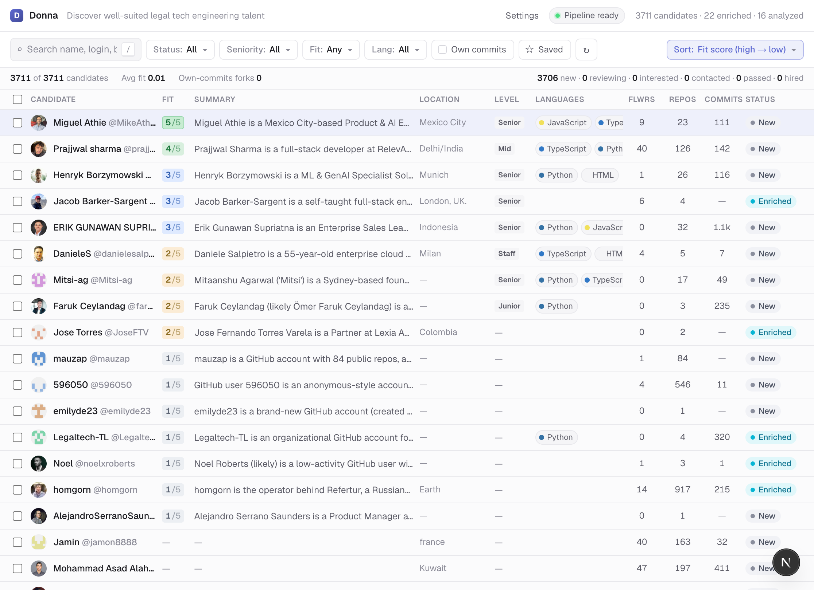
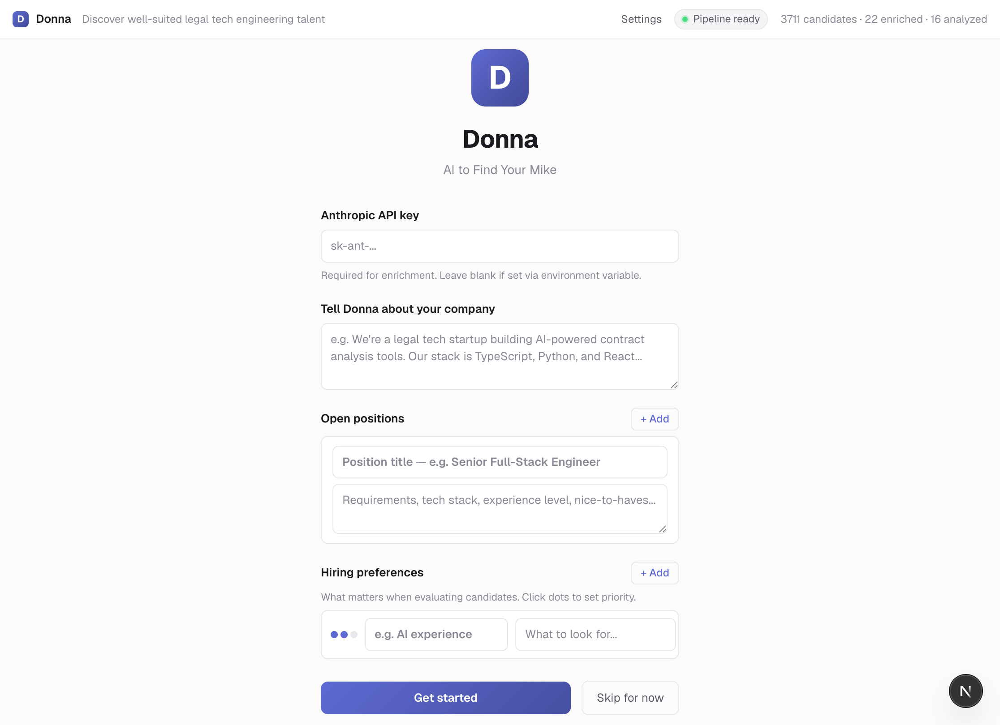
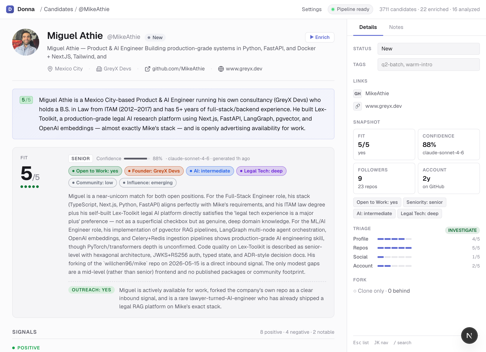
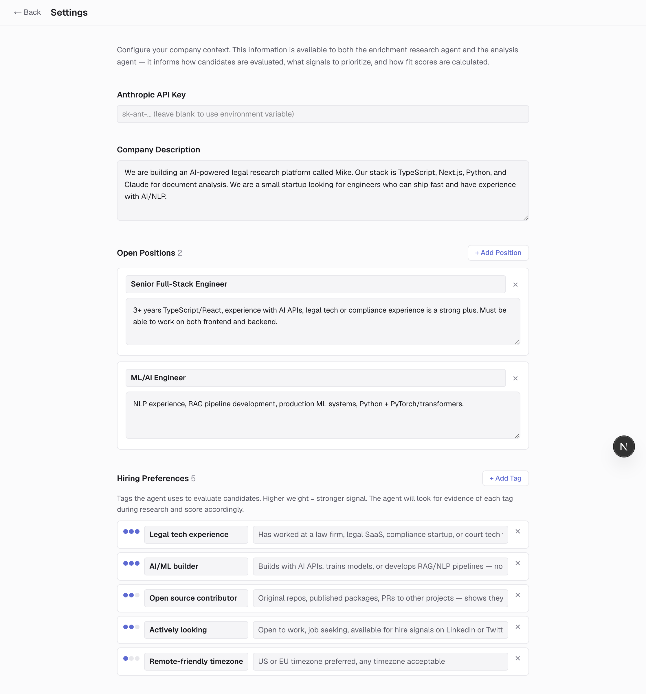

# Donna

**AI to Find Your Mike**

> *"I'm Donna. I know everything."*
> *— Donna Paulsen, Pearson Hardman*

Harvey needs associates. Mike is open source. Donna finds the people.

**[mike](https://github.com/willchen96/mike)** is an open-source AI legal platform. Donna watches everyone who touches it — every fork, every star, every issue filed, every pull request opened — and builds deep intelligence dossiers on each person using a 12-tool AI enrichment pipeline. She knows who's a senior engineer, who's a lawyer, who runs their own company, who's open to work, and who you should reach out to first.

She's not a recruiter. She's Donna.



---

## What She Does

Donna is a full-stack agentic talent intelligence platform. Point her at a GitHub repo and she will:

1. **Seed** — Automatically ingest every person who has interacted with the repo: forkers, stargazers, issue authors, PR authors, and contributors. 3,700+ candidates from mike and growing.

2. **Hydrate** — Batch-fetch GitHub profiles via GraphQL — follower counts, public repos, total commits, bios, locations, companies — so you can sort and prioritize before spending tokens on deep research.

3. **Triage** — Score each candidate's GitHub profile on four dimensions (profile depth, repo volume, social signal, account age) and issue a verdict: **SKIP** (ghost account, don't waste tokens), **LIGHT** (quick look), or **INVESTIGATE** (full research).

4. **Enrich** — Deploy a Claude-powered AI agent with 12 specialized tools to research each candidate in depth. The agent streams its work in real time — you watch it think, search, scrape, and analyze.

5. **Analyze** — After enrichment, a structured extraction step distills everything into a typed profile: fit score, seniority level, signals, skills, LinkedIn data, web mentions, and 8 top-line category assessments.

6. **Surface** — Present everything in a responsive, keyboard-navigable UI with filtering, sorting, bookmarking, batch enrichment, and a CRM pipeline.

---

## First Boot

On first launch, Donna walks you through onboarding:

1. **Bring your own key** — Enter your Anthropic API key (or leave blank if it's set via environment variable)
2. **Tell Donna about your company** — Free-text company description
3. **Add open positions** — Structured cards with title + description (add as many as you want)
4. **Set hiring preferences** — Weighted tags with priority dots (1-3) that calibrate how candidates are scored
5. **Auto-seed** — Donna fetches all candidates from GitHub automatically
6. **Auto-hydrate** — Pulls follower counts, repos, commits, bios, and locations via GraphQL so you can sort immediately

Skip any step and configure later via Settings.



---

## The Enrichment Pipeline

When Donna investigates a candidate, she dispatches an AI agent equipped with 12 tools:

| Tool | What It Does |
|------|-------------|
| `company_context` | Reads your company description, open positions, and hiring preferences from Settings. Called first to calibrate the research. |
| `gh_query` | Queries the GitHub REST API — profile details, repositories, commit history, languages, contribution graph. |
| `web_search` | Searches Google via Firecrawl to find the candidate's digital footprint across the web. |
| `web_scrape` | Extracts full page content as markdown from any URL the agent discovers. |
| `linkedin_lookup` | Launches a stealth headless browser (Browserbase + Stagehand) to extract LinkedIn profile, experience, education, skills, certifications, and recent activity. |
| `twitter_lookup` | Same stealth browser approach for Twitter/X — bio, recent tweets, engagement signals. |
| `technical_assess` | Spawns a subagent that reads actual source code from the candidate's repos and assesses engineering ability, code quality, and architecture taste. |
| `legal_relevance_assess` | Spawns a subagent that investigates connections to the legal industry — law degrees, bar admissions, legal tech companies, court-related work. |
| `github_contributions` | Finds PRs merged and issues filed on other people's repos — measures community engagement beyond their own projects. |
| `package_registry` | Checks npm and PyPI for published packages — are they a library author? |
| `devto_posts` | Searches dev.to and Hashnode for blog posts and technical writing. |
| `stackoverflow_lookup` | Pulls Stack Overflow reputation, top tags, and answer count. |

The agent doesn't just run every tool blindly. It reads the triage card, plans a research strategy, and adapts. A SKIP candidate gets 1-2 sentences and moves on. An INVESTIGATE candidate gets the full treatment — the agent might spend 50+ steps chasing leads across the web.



---

## The Analysis

After enrichment, Donna runs a structured extraction pass using `generateObject()` with a Zod schema. This produces:

| Field | Type | Description |
|-------|------|-------------|
| `fitScore` | 1-5 | Overall fit for your open positions |
| `seniority` | junior / mid / senior / staff | Engineering experience level |
| `recommendedOutreach` | yes / no / maybe | Should you reach out? |
| `confidence` | 0.0-1.0 | How confident Donna is in her assessment |
| `openToWork` | yes / no / maybe / unknown | Employment availability signals |
| `isLawyer` | yes / no / maybe / unknown | Legal profession indicators |
| `hasOwnCompany` | yes / no / unknown | Runs their own business? |
| `aiExperience` | none → advanced | AI/ML experience depth |
| `legalTechRelevance` | deep / adjacent / transferable / none | Legal tech connection strength |
| `communityActivity` | none → high | OSS community engagement |
| `influenceLevel` | none → notable | Developer influence and reach |
| `signals[]` | positive / negative / notable | Key findings with explanations |
| `skills[]` | string[] | Extracted technical skills |
| `linkedin` | object | Structured LinkedIn profile data |
| `webMentions[]` | object[] | Blog posts, conference talks, news articles |

Fit scores are calibrated against your configured hiring preferences and their weights (1-3).

---

## The Triage System

Before spending API tokens on deep research, Donna scores each candidate on four axes:

| Dimension | How It's Scored | Max |
|-----------|----------------|-----|
| **Profile Depth** | +1 each for: name, bio, blog, twitter, company | 5 |
| **Repo Volume** | `floor(publicRepos / 3)`, capped | 5 |
| **Social Signal** | Follower thresholds: 2 / 10 / 50 / 200 / 1000 | 5 |
| **Account Age** | Years since GitHub account creation | 5 |

| Total Score | Verdict | Agent Behavior |
|-------------|---------|---------------|
| < 4 | **SKIP** | Ghost/empty account. 1-2 sentences, move on. |
| 4-7 | **LIGHT** | Quick research. 3-4 tool calls max. |
| 8+ | **INVESTIGATE** | Full deep dive. All relevant tools. |

The agent sees these scores but can override them — a LIGHT candidate with an unexpectedly deep profile might get upgraded to INVESTIGATE.

---

## Architecture

```
GitHub API (gh cli + GraphQL)
       │
  POST /api/seed ──► Candidate rows in PostgreSQL
       │                (forkers, stargazers, issue/PR authors, contributors)
       │
  POST /api/seed/hydrate ──► GraphQL batch fetch (5 users/query)
       │                       followers, repos, commits, bio, location
       │
  POST /api/enrich/[login] ──► BullMQ job queued in Redis
       │
  BullMQ Worker (enrich-worker.ts)
       │  streamText() with 12 tools
       │  Publishes events to Redis Pub/Sub: scout:enrich:{login}
       │
  GET /api/enrich/[login]/stream ──► SSE endpoint
       │                              subscribes to Redis Pub/Sub
       │
  Client (enrich-stream.tsx) ──► Real-time markdown + structured cards
       │
  Post-enrichment: generateObject() with Zod schema
       │  Extracts fitScore, seniority, signals, skills, LinkedIn, web mentions
       │
  Prisma interactive $transaction ──► Profile, Signal, Skill, LinkedInProfile, WebMention
       │
  Auto-promote CRM status: "new" → "enriched"
```

### Key Design Decisions

- **BullMQ over fire-and-forget** — Real job queue with Redis. Worker runs in the Next.js process via `globalThis` singleton (survives HMR). Concurrency 2. Navigate away and come back — enrichment continues.
- **Redis Pub/Sub for SSE** — Worker publishes to `scout:enrich:{login}`, SSE endpoint creates a fresh subscriber per connection. Clean separation between job execution and event delivery.
- **Tool-result-driven cards** — The model writes pure markdown narrative. The server auto-generates structured UI cards (ProfileHeader, MetricGrid, TriageCard, RepoCard) from tool result JSON.
- **Interactive Prisma transactions** — `$transaction(async (tx) => ...)` instead of batch `$transaction([...])` because the batch approach breaks TypeScript when mixing operations across models.
- **Settings-driven scoring** — Job positions and weighted hiring preferences are injected into both the enrichment agent system prompt and the analysis scoring prompt.
- **BYOK API key** — Anthropic API key can be entered via UI (stored in Settings DB with 30s cache) or set via environment variable. All consumers resolve the key at runtime.



- **Stale Prisma client detection** — The `globalThis` singleton compares the `PrismaClient` constructor reference to detect when `prisma generate` has produced a new client, and recreates automatically.

---

## Data Model

```
Candidate (login PK)
  ├── ForkMeta (1:1) — fork URL, push date, ahead/behind, own commits
  ├── Repo[] — name, language, stars, forks
  ├── Event[] — push, PR, issue events
  ├── Profile (1:1) — summary, fitScore, seniority, 8 category fields
  ├── Signal[] — positive/negative/notable findings
  ├── Skill[] — extracted technical skills
  ├── Crm (1:1) — status, bookmarked, notes, tags
  ├── LinkedInProfile (1:1) — headline, experience, education, skills
  ├── WebMention[] — blog posts, conference talks, news
  ├── EnrichmentLog[] — tool call history with timing
  └── AgentMemory[] — persistent agent state

Settings
  ├── Setting (key-value) — anthropic_api_key, company_description
  ├── JobPosition[] — title + description
  └── HiringPreference[] — tag + description + weight (1-3)
```

---

## UI

- **Onboarding** — First-boot setup: API key, company description, structured job positions, weighted hiring preferences. Auto-seeds and hydrates after.
- **List view** — Sortable, filterable table with fit score, seniority, languages, followers, repos, commits, and CRM status. Multi-select rows for batch enrichment. Sort by commits, followers, fit score, or name.
- **Detail view** — Full candidate profile with tabbed sidebar (Details | Notes), assessment cards with color-coded category pills, signal list, repo cards, source links.
- **Enrichment stream** — Real-time view of the AI agent working. Streaming markdown text interleaved with structured data cards. Thinking indicator, auto-scroll, animated transitions.
- **Settings** — Anthropic API key (auto-save), company description (auto-save), structured job positions (CRUD), weighted hiring preference tags with visual dot indicators.
- **Sync** — ↻ button in toolbar re-fetches from GitHub and hydrates new candidates.
- **Mobile** — Responsive layout with bottom sheet sidebar, touch-optimized list rows.
- **Keyboard navigation** — Arrow keys to browse, Enter to open, Space to select, `/` to search, `e` to enrich.


### Filters

| Filter | Options |
|--------|---------|
| Status | New, Enriched, Reviewing, Interested, Contacted, Passed, Hired |
| Seniority | Junior, Mid, Senior, Staff |
| Fit | 2+, 3+, 4+, 5 only |
| Language | TypeScript, Python, Rust, Go, Elixir, Java |
| Own Commits | Toggle — forkers who pushed original code |
| Saved | Toggle — bookmarked candidates |

---

## Setup

### Prerequisites

- Node.js 20.19+
- Docker (for PostgreSQL + Redis)
- `gh` CLI authenticated (`gh auth login`)
- Anthropic API key (enter during onboarding or set via environment)

### Quick Start

```bash
# 1. Start infrastructure
docker compose up -d   # PostgreSQL :54320, Redis :63790

# 2. Install and initialize
cd web
npm install
npx prisma generate
npx prisma db push

# 3. Start the dev server
npm run dev
# Open http://localhost:3000
```

On first load, Donna walks you through onboarding — company description, open positions, hiring preferences. Then she automatically seeds candidates from GitHub and hydrates their profiles. No manual steps.

To manually re-sync and pick up new stargazers/contributors, click the **↻** button in the toolbar.

### Environment

API keys can be entered through the UI during onboarding, or set as environment variables in `mise.local.toml`:

| Variable | Required | Purpose |
|----------|----------|---------|
| `ANTHROPIC_API_KEY` | Via UI or env | Claude API for enrichment + analysis |
| `FIRECRAWL_API_KEY` | Yes | Web search and page scraping |
| `BROWSERBASE_API_KEY` | For LinkedIn/Twitter | Headless browser sessions |
| `BROWSERBASE_PROJECT_ID` | For LinkedIn/Twitter | Browserbase project |
| `DATABASE_URL` | Auto | `postgresql://...@localhost:54320/scout` |
| `REDIS_URL` | Auto | `redis://localhost:63790` |

### Infrastructure

| Service | Port | Purpose |
|---------|------|---------|
| PostgreSQL | 54320 | Candidate data, profiles, CRM |
| Redis | 63790 | BullMQ job queue + Pub/Sub for SSE |
| Next.js | 3000 | Web app + API + enrichment worker |

---

## Python Pipeline (Legacy)

The original pipeline is still available as a CLI. It uses the same database.

```bash
cd pipeline && uv sync
```

| Command | Description |
|---------|-------------|
| `uv run scout fetch-forks` | Paginate forkers into Candidate + ForkMeta rows |
| `uv run scout fetch-contributors` | Fetch contributors, issue/PR authors, stargazers |
| `uv run scout enrich [--limit N]` | GitHub profile + repos + events |
| `uv run scout web-enrich [--limit N]` | LinkedIn + web presence via Stagehand + Firecrawl |
| `uv run scout analyze [--limit N]` | Claude Opus structured analysis |
| `uv run scout run` | Full pipeline: fetch → enrich → web-enrich → analyze |
| `uv run scout deep-dive <login>` | Agent SDK deep-dive on a single candidate |
| `uv run scout stats` | Print counts by status |

---

## Tech Stack

| Layer | Technology |
|-------|-----------|
| Framework | Next.js 15 (App Router) |
| Language | TypeScript + Python |
| Database | PostgreSQL (Prisma ORM) |
| Job Queue | BullMQ (Redis) |
| AI | Claude Opus 4 via Vercel AI SDK (`streamText` / `generateObject`) |
| Browser Automation | Browserbase + Stagehand (LinkedIn, Twitter) |
| Web Intelligence | Firecrawl (search + scrape) |
| Animations | Motion (motion/react) |
| Styling | Vanilla CSS + Tailwind responsive utilities |
| Schema Validation | Zod |
| Python Pipeline | Click CLI + Claude Agent SDK |

---

## API Routes

| Route | Method | Purpose |
|-------|--------|---------|
| `/api/seed` | POST | Seed candidates from GitHub (forks, stars, issues, PRs, contributors) |
| `/api/seed/hydrate` | POST | Batch-fetch GitHub profiles via GraphQL (followers, repos, commits) |
| `/api/enrich/[login]` | POST | Queue enrichment job for a candidate |
| `/api/enrich/[login]` | GET | Get enrichment status + recent logs |
| `/api/enrich/[login]/stream` | GET | SSE stream of real-time enrichment events |
| `/api/enrich/batch` | POST | Queue enrichment for multiple candidates |
| `/api/settings` | GET/PUT | Key-value settings (anthropic_api_key, company_description) |
| `/api/settings/positions` | GET/POST/PUT/DELETE | Job position CRUD |
| `/api/settings/preferences` | GET/POST/PUT/DELETE | Hiring preference CRUD (tag + weight) |

### SSE Protocol

The enrichment stream publishes these event types:

| Event | Payload | Purpose |
|-------|---------|---------|
| `text` | `{ text: string }` | Streaming markdown text delta |
| `tool-start` | `{ tool: string, args: string }` | Tool invocation began |
| `tool-end` | `{ tool: string }` | Tool finished |
| `card` | `{ card: string, props: object }` | Structured UI card (ProfileHeader, MetricGrid, TriageCard, RepoCard) |
| `sep` | `{}` | Step separator |
| `done` | `{}` | Enrichment complete |

---

## File Map

### Enrichment Pipeline

| File | Purpose |
|------|---------|
| `web/src/lib/anthropic.ts` | API key resolver — checks Settings DB (30s cache), falls back to env |
| `web/src/lib/queue.ts` | BullMQ queue + worker setup via `globalThis` singleton |
| `web/src/lib/enrich-worker.ts` | Main enrichment logic — `runEnrichment()` + `runAnalysis()` |
| `web/src/lib/tools/index.ts` | Tool registry (12 tools) + system prompt |
| `web/src/lib/tools/company-context.ts` | Reads Settings/JobPosition/HiringPreference from DB |
| `web/src/lib/tools/gh-query.ts` | GitHub REST API via `gh` CLI |
| `web/src/lib/tools/web-search.ts` | Google search via Firecrawl |
| `web/src/lib/tools/web-scrape.ts` | Page extraction via Firecrawl |
| `web/src/lib/tools/linkedin-lookup.ts` | LinkedIn scraping via Browserbase + Stagehand |
| `web/src/lib/tools/twitter-lookup.ts` | Twitter/X scraping via Browserbase + Stagehand |
| `web/src/lib/tools/technical-assess.ts` | Subagent: source code analysis |
| `web/src/lib/tools/legal-assess.ts` | Subagent: legal industry connections |
| `web/src/lib/tools/github-contributions.ts` | Cross-repo PR/issue activity |
| `web/src/lib/tools/package-registry.ts` | npm/PyPI published packages |
| `web/src/lib/tools/devto-posts.ts` | dev.to / Hashnode blog posts |
| `web/src/lib/tools/stackoverflow-lookup.ts` | Stack Overflow reputation + tags |

### UI Components

| File | Purpose |
|------|---------|
| `web/src/components/seeding-state.tsx` | Onboarding flow: setup form → seed → hydrate → ready |
| `web/src/components/enrich-stream.tsx` | Real-time enrichment viewer with streaming markdown + cards |
| `web/src/components/candidate-list.tsx` | List view with multi-select + batch enrich |
| `web/src/components/candidate-row.tsx` | Individual candidate row in list |
| `web/src/components/filter-bar.tsx` | Search, filters, sort, sync button |
| `web/src/components/assessment-card.tsx` | Color-coded category pills |
| `web/src/components/signal-list.tsx` | Positive/negative/notable signals |
| `web/src/components/detail-with-enrich.tsx` | Detail page wrapper with enrichment context |
| `web/src/components/crm-panel.tsx` | Status, notes, tags management |
| `web/src/components/mobile-sheet.tsx` | Bottom sheet sidebar for mobile |

---

## The Name

In *Suits*, **Donna Paulsen** is Harvey Specter's executive assistant at Pearson Hardman. She's not a lawyer, but she might as well be. She knows everything about everyone — every client, every deal, every skeleton in every closet. She sees things coming before they happen. When Harvey needs to know who someone really is, he doesn't Google them. He asks Donna.

**Mike Ross** is the brilliant fraud who never went to law school but practices law anyway. He's the open-source legal AI platform — [willchen96/mike](https://github.com/willchen96/mike) — doing legal work without the traditional credentials.

This project is what happens when you point Donna at everyone who's ever touched Mike's world. She finds them, researches them, figures out who they really are, and tells Harvey which ones are worth a conversation.

She doesn't miss anyone. She's Donna.

---

## License

Private. Internal use only.
